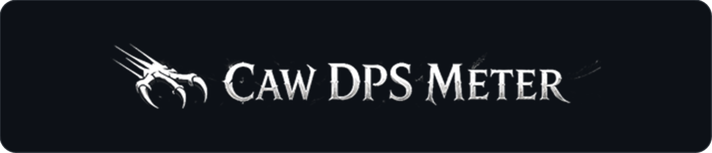
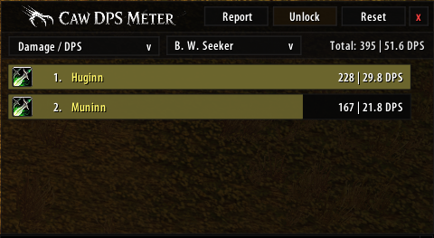
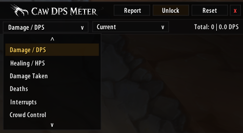

  

# Caw DPS Meter 1.0.8

A compact WoW 1.12 combat meter for damage, healing, utility and aura tracking, with up to four independent windows sharing the same combat data.

## Screenshots

  
  &nbsp;&nbsp;
  

## Requirements and installation

Requires SuperWoW and the SuperAPI addon. pfUI and TWThreat are optional. Close the game and extract the release ZIP so that `CawDPSMeter.toc` is inside `Interface/AddOns/CawDPSMeter/`. Restart the client after updating; version 1.0.8 adds several files. Use `/cd` to toggle the main window.

## Windows and pfUI

Use the + button for additional windows. Each window keeps its own mode, size, position and scroll offset. All windows now use matching bar dimensions and scroll controls.

Right-click a window's lock icon to dock/undock it at the pfUI right chat. Multiple docked windows sit edge-to-edge side by side inside the right chat area, above its status panel and follow its arrow visibility. Combat recording and sync continue while hidden. Free windows remain independent. No pfUI files are modified; without pfUI the addon works normally.

## Threat and Caw Sync

Damage/healing combat snapshots use Caw Sync. Compatible clients also announce their presence and capabilities automatically. Threat tooltips distinguish detected clients, expired replies and actual current talent data. No reply does not prove that someone has no Caw installed.

Threat is calculated locally and remains experimental. All classes exchange talent ranks/max ranks by tree and slot. Feral Instinct is currently the only remote talent applied by the threat engine; other modifiers and several utility/resource/healing rules remain incomplete. Unknown talents stay unknown. TWThreat is no longer required for server calibration: Caw can directly query the API and show a separately labeled server reference while its local engine continues unchanged.

## Local calibration recordings

This release records calibration data automatically unless the character has disabled it. `/cdthreatcal off` disables recording and its automatic startup; `/cdthreatcal on` enables it again. A startup message confirms active recording. No files are uploaded automatically. With TWThreat loaded, Caw passively records its replies; standalone calibration can query eligible combat targets.

The latest 12 sessions are kept, each limited to 12,000 model events, 6,000 casts, 6,000 snapshots, 2,000 actor contexts and bounded supporting traces. Save by reloading or logging out normally. To report a discrepancy, include version, target, ability and relevant saved calibration data. Recordings can contain player names and GUIDs; review them before sharing publicly.

## Useful controls

- `/cd show` / `/cd hide`: main window visibility.
- `/cd lock` / `/cd unlock`: main window movement and resizing.
- `/cd reset`: current fight; `/cd resetoverall`: overall data.
- `/cd current` / `/cd last` / `/cd overall`: segment selection.
- Window menus select modes and history; the Report button sends the selected report.

Window settings persist. Current/overall combat data and fight history do not survive reload/logout. All group clients should update to exchange compatible data.

See [CHANGELOG.md](CHANGELOG.md) and [release notes](RELEASE_NOTES_1.0.8.md) for changes and known limits. The regression suite uses mocked WoW APIs; a live client is still needed for visual and multiplayer verification.

## Talent synchronization

Talent layouts are sampled once per second, sent on change and refreshed every 30 seconds. Each tree is one bounded packet; packets are spaced by at least 0.2 seconds. A profile becomes usable only after all trees arrive. Profiles expire after 90 seconds and are removed when the player leaves the group. Layouts contain ranks and maximum ranks by tree/slot, not localized talent names or inferred threat formulas. Up to 200 distinct received actor/layout combinations per calibration session are retained. Talent data is exchanged only with the current party/raid; nothing is uploaded automatically. Restart the client after updating to load CawTalentSync.lua.

## Standalone server reference

Disable TWThreat and restart the client to load CawServerThreat.lua. With calibration enabled (the default), Caw queries the server for hostile NPC combat targets while in a party/raid. The current Threat view automatically shows `Server reference*` when a recent own-request snapshot passes target/segment checks; otherwise it shows `Local estimate`. History/overall remain local. The tooltip identifies the source and, when matched, the parallel local value.

The request uses `limit=4`, matching the tested TWThreat default request; the display contains the returned rows, not a guaranteed full raid table. The target must have been stable for two seconds at request time; snapshots expire after 1.25 seconds. TWTv4 has no target/request ID, so even accepted context is provisional. After a timeout or parallel-probe ambiguity, server display is suppressed until reload. With TWThreat loaded, Caw keeps passive calibration and local display instead.

`/cdthreatcal off` stops recording and Caw's direct queries, returning the view to local estimates. Recording caps do not freeze an otherwise eligible live server display. Live verification of this standalone release path is still pending.
